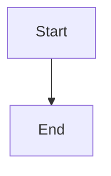

# Nested Code Block Rendering

## Basic rendered markdown

````markdown
# Heading inside code block

This is **bold** and *italic* text.

- Item 1
- Item 2
- Item 3

```js
console.log("syntax highlighted inside rendered markdown");
```
````

## Using `md` alias

````md
## Subheading

> A blockquote inside rendered markdown

1. First
2. Second
````

## `markdown:code` fallback

Should render as plain code, not as markdown:

````markdown:code
# This is plain code
Not rendered as markdown.
````

## Mermaid inside rendered markdown

`````markdown
A mermaid diagram rendered inside a markdown block:


`````

## Depth 1 nesting

``````markdown
### Outer (depth 1)

`````markdown
### Inner (depth 2)

Rendered markdown two levels deep.
`````
``````

## Depth 2 nesting

```````markdown
### Outer (depth 1)

``````markdown
### Middle (depth 2)

`````markdown
### Inner (depth 3)

Three levels deep.
`````
``````
```````

## Depth 4 nesting (fallback)

````````markdown
### Depth 1

```````markdown
### Depth 2

``````markdown
### Depth 3

`````markdown
### Depth 4 — plain code fallback

This should render as a plain `<pre><code>` block.
`````
``````
```````
````````

## Depth 5 nesting (not rendered)

`````````markdown
### Depth 1

````````markdown
### Depth 2

```````markdown
### Depth 3

``````markdown
### Depth 4 — code block

`````markdown
### Depth 5

This fence should appear as literal text inside the depth 4 code block.
`````
``````
```````
````````
`````````
